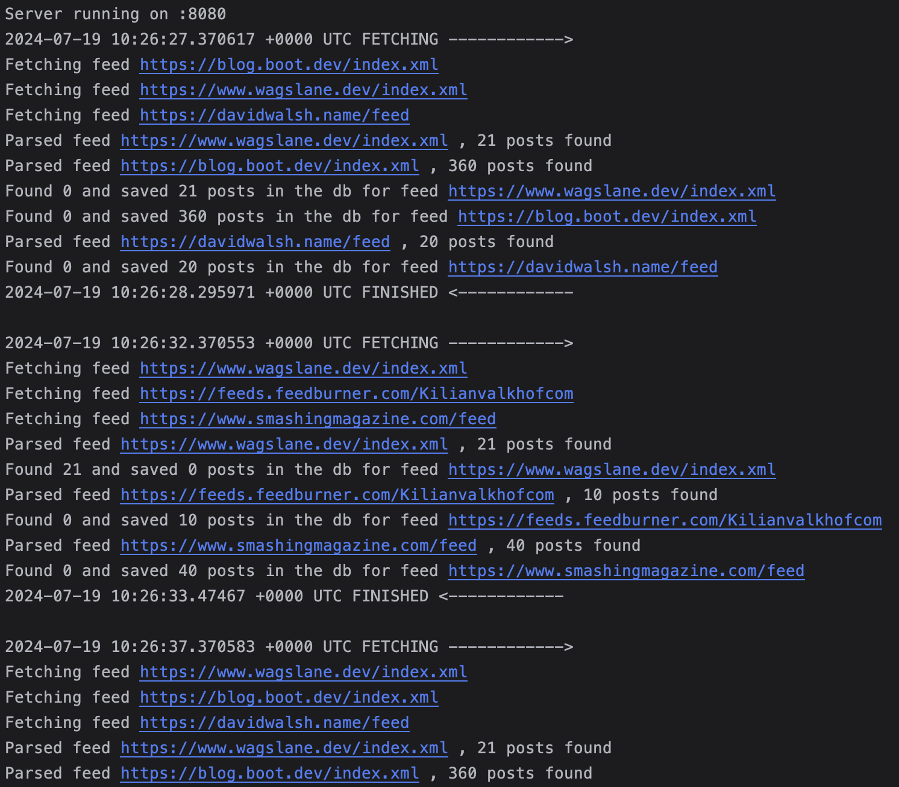

# RSS Feed scraper

### REST API exposing data fetched from a scheduler

Uses

- go stdlib for server/scheduler
- sqlc for generating go code for sql queries, with lib/pq as adapter
- goose for db migrations
- godotenv for loading env files

## Setup

- Install

`go install`

- Copy the <b>.sample</b> files, rename them to `.env` and `.goose.env`, then override the necessary values

### Migrations

`source .goose.env && goose up`

## Run server

`go build -o out && ./out`

## Scheduler
The scheduler will run a query to get the most N(configurable) outdated feeds and will fetch the RSS in parallel, depending on the concurrency setting(also configurable)



## REST API endpoints

⚠️ All requests that have the `Authorization` header specified will result in a <b>401</b> response if not provided

### [GET /v1/feeds](./api/feedRoutes.go)

Gets feeds

Returns <span style="color:green">200

```json
[
  {
    "id": "93358803-8f28-4e17-8a7f-a4335cd7a153",
    "created_at": "2024-07-17T01:05:10.441+03:00",
    "updated_at": "2024-07-19T02:36:07.816137+03:00",
    "url": "https://blog.boot.dev/index.xml",
    "name": "The Boot.dev Blog",
    "user_id": "317fe9f2-611d-4854-8d29-e4c47c1eb187",
    "last_fetched_at": "2024-07-19T02:36:07.816137Z"
  },
  {
    "id": "dbe3d545-cabd-4901-a5aa-060deccf1db3",
    "created_at": "2024-07-19T01:26:10.250796+03:00",
    "updated_at": "2024-07-19T02:36:07.981368+03:00",
    "url": "https://feeds.feedburner.com/Kilianvalkhofcom",
    "name": "Kilian Valkhof",
    "user_id": "317fe9f2-611d-4854-8d29-e4c47c1eb187",
    "last_fetched_at": "2024-07-19T02:36:07.981368Z"
  },
  ...
]
```

### [POST /v1/feeds](./api/feedRoutes.go)

Creates a feed and subscribes the user to it

```http request
Content-Type: application/json
Authorization: ApiKey 22c6177fa722a5e1fe5da58cf1cdbb6ed907c2810debf6722c070c056d8afe63
```

```json 
{
  "name": "Smashing Magazine",
  "url": "https://www.smashingmagazine.com/feed"
}
```

Returns <span style="color:green">200</span> OR <span style="color:red">400</span>(if url exists)

```json
{
  "feed": {
    "id": "a3452c4b-96ab-41f5-bd44-986ab82c4a0f",
    "created_at": "2024-07-19T01:25:03.904164+03:00",
    "updated_at": "2024-07-19T01:25:03.904165+03:00",
    "name": "Smashing Magazine",
    "url": "https://www.smashingmagazine.com/feed",
    "user_id": "317fe9f2-611d-4854-8d29-e4c47c1eb187",
    "last_fetched_at": null
  },
  "follow": {
    "feed_id": "a3452c4b-96ab-41f5-bd44-986ab82c4a0f",
    "user_id": "317fe9f2-611d-4854-8d29-e4c47c1eb187",
    "followed_at": "2024-07-18T22:25:03.90523Z"
  }
}
```

### [POST /v1/feeds/{feedId}/follow](./api/feedRoutes.go)

The current authenticated user will follow the feed

```http request
Authorization: ApiKey 22c6177fa722a5e1fe5da58cf1cdbb6ed907c2810debf6722c070c056d8afe63
```

Returns <span style="color:green">200</span> OR <span style="color:red">404</span>(if feed does not exists)

```json
{
  "feed_id": "a3452c4b-96ab-41f5-bd44-986ab82c4a0f",
  "user_id": "317fe9f2-611d-4854-8d29-e4c47c1eb187",
  "followed_at": "2024-07-18T22:25:03.90523Z"
}
```

### [DELETE /v1/feeds/{feedId}/follow](./api/feedRoutes.go)

The current authenticated user will unfollow the feed

```http request
Authorization: ApiKey 22c6177fa722a5e1fe5da58cf1cdbb6ed907c2810debf6722c070c056d8afe63
```

Returns <span style="color:green">204</span> OR <span style="color:red">404</span>(if feed was not followed initially)

### [GET /v1/posts](./api/postRoutes.go)

Gets posts from followed feeds of the current user

Optional query param `limit`

```http request
Content-Type: application/json
Authorization: ApiKey 22c6177fa722a5e1fe5da58cf1cdbb6ed907c2810debf6722c070c056d8afe63
```

Returns <span style="color:green">200

```json
[
  {
    "id": "6351bfba-3883-4e61-8fe2-68188d4ebe09",
    "created_at": "2024-07-18T23:11:47.953699Z",
    "updated_at": "2024-07-18T23:11:47.953699Z",
    "published_at": "2023-01-08T00:00:00Z",
    "title": "The Zen of Proverbs",
    "url": "https://wagslane.dev/posts/zen-of-proverbs/",
    "description": "20 rules of thumb for writing better software.\nOptimize for simplicity first Write code for humans, not computers Reading is more important than writing Any style is fine, as long as it&rsquo;s black There should be one way to do it, but seriously this time Hide the sharp knives Changing the rules is better than adding exceptions Libraries are better than frameworks Transitive dependencies are a problem Dynamic runtime dependencies are a bigger problem API surface area is a liability Returning early is a good thing Use more plain text Compiler errors are better than runtime errors Runtime errors are better than bugs Tooling is better than documentation Documentation is better than nothing Configuration sucks, but so does convention The cost of building a feature is its smallest cost Types are one honking great idea &ndash; let&rsquo;s do more of those!",
    "feed_id": "8f91e3aa-0197-4077-85e6-c86b26aa2d26"
  },
  {
    "id": "cffaecd5-5d92-4d62-a73e-9e6667c92561",
    "created_at": "2024-07-18T23:11:47.964966Z",
    "updated_at": "2024-07-18T23:11:47.964966Z",
    "published_at": "2022-12-17T00:00:00Z",
    "title": "College: A Solution in Search of a Problem",
    "url": "https://wagslane.dev/posts/college-a-solution-in-search-of-a-problem/",
    "description": "College has been prescribed almost universally by the parents of the last ~40 years as the solution to life&rsquo;s problems. We&rsquo;ve been told it&rsquo;s the way to land a good job and to make more money. But is it?\nI think that most college degrees these days commit a cardinal sin in the business world. College degrees are solutions in search of a problem.\nWhat is a solution in search of a problem?",
    "feed_id": "8f91e3aa-0197-4077-85e6-c86b26aa2d26"
  },
  ...
```

If the user does not follow any feed an empty array will be returned instead

### [GET /v1/user](./api/userRoutes.go)

Gets current user

```http request
Content-Type: application/json
Authorization: ApiKey 22c6177fa722a5e1fe5da58cf1cdbb6ed907c2810debf6722c070c056d8afe63
```

Returns <span style="color:green">200

```json
{
  "id": "317fe9f2-611d-4854-8d29-e4c47c1eb187",
  "name": "john",
  "created_at": "2024-07-15T22:48:39.471928Z",
  "updated_at": "2024-07-15T22:48:39.471928Z",
  "api_key": "22c6177fa722a5e1fe5da58cf1cdbb6ed907c2810debf6722c070c056d8afe63"
}
```

### [POST /v1/user](./api/userRoutes.go)

Creates a new user

```json
{
  "name": "john"
}
```

Returns <span style="color:green">201</span>

```json
{
  "id": "317fe9f2-611d-4854-8d29-e4c47c1eb187",
  "name": "john",
  "created_at": "2024-07-15T22:48:39.471928Z",
  "updated_at": "2024-07-15T22:48:39.471928Z",
  "api_key": "22c6177fa722a5e1fe5da58cf1cdbb6ed907c2810debf6722c070c056d8afe63"
}
```
